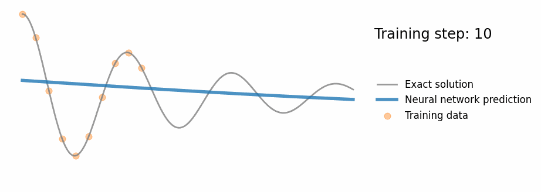
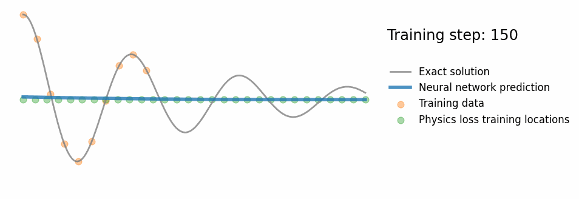

# Harmonic-Oscillator-PINN

## Overview of the Problem
In this project, we tackle the problem of modeling the dynamics of a one-dimensional (1D) damped harmonic oscillator. The mathematical formulation of this system is given by the following second-order ordinary differential equation (ODE):
$$m \dfrac{d^2 x}{d t^2} + \mu \dfrac{d x}{d t} + kx = 0~,$$
Initial Conditions
The system starts from an initial position $x(0)=1$ and initial velocity $\frac{d x}{d t}=0$.
Under-damped State
We specifically focus on solving the problem in its under-damped state, defined by the condition:
$$\delta<\omega_0$$
where $\delta=\frac{\mu}{2 m}$ is the damping coefficient, and $\omega_0=\sqrt{\frac{k}{m}}$ is the natural frequency of the system.

Analytical Solution
The exact analytical solution for the system in the under-damped state is given by:
$$x(t)=e^{-\delta t}(2 A \cos (\phi+\omega t))$$
where $\omega=\sqrt{\omega_0^2-\delta^2}$ is the damped angular frequency.

By solving this problem, we aim to validate the effectiveness of Physics-Informed Neural Networks (PINNs) in capturing both the data-driven and physics-based characteristics of complex dynamical systems.

## Overview of the Workflow
In this project, we aim to solve a complex physics problem through machine learning by employing two primary steps:

1. __Standard Neural Network Training__: Initially, a standard neural network is trained to interpolate a subset of the solution. This is done using observed training points taken directly from the known analytical solution.

2. __Physics-Informed Neural Network (PINN) Training__: To extrapolate the solution outside of the training points, we use a Physics-Informed Neural Network (PINN). The PINN incorporates the underlying physics of the problem into its loss function, enabling it to generalize beyond the initial training data.

By leveraging both approaches, we can create a model that not only fits the available data but also respects the physical laws governing the system.

## Visualizations of the Learning Process

The following GIFs demonstrate how the models learn over time, providing an intuitive understanding of the learning dynamics.

### Neural Network Learning Process



### Physics-Informed Neural Network Learning Process



## Environment Setup
To execute the code and train the Physics-Informed Neural Network, we utilize PyTorch, a robust and widely-used machine learning library. Below are the steps to set up the working environment:
```commandline
# Create a new Conda environment with Python 3.x
conda create -n pinn python=3

# Activate the newly created environment
conda activate pinn

# Install Jupyter Notebook, NumPy, and Matplotlib for data manipulation and visualization
conda install jupyter numpy matplotlib

# Install PyTorch and its associated libraries for machine learning tasks
conda install pytorch torchvision torchaudio -c pytorch
```
